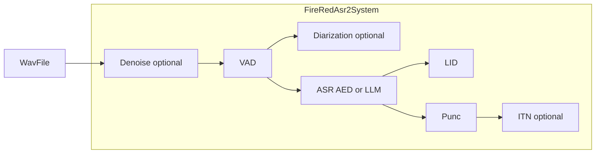

# FireRedASR2S 与常见 ASR 工具链功能对照

本文将「成熟语音交互 / ASR 工具链」中常见能力与本仓库实现情况对照，便于选型与二次开发。路径均相对于仓库根目录。

---

## 基础核心功能

| 能力 | 本项目状态 | 说明与依据 |
|------|------------|------------|
| **语音识别 (ASR)** | **已实现** | [`fireredasr2s/fireredasr2/asr.py`](fireredasr2s/fireredasr2/asr.py)；**AED** 与 **LLM**；`FireRedAsr2Config.runtime` 控制 LLM 解码后端骨架（见 [`docs/RUNTIMES.md`](RUNTIMES.md)）。 |
| **语种识别 (LID)** | **已实现** | [`fireredasr2s/fireredlid/`](fireredasr2s/fireredlid/)；`FireRedAsr2System` 在 `enable_lid` 时批处理。 |
| **标点预测 (PUNC)** | **已实现** | [`fireredasr2s/fireredpunc/`](fireredasr2s/fireredpunc/)；支持 `device` / `use_half` 与 ASR 设备对齐。 |
| **逆文本正则化 (ITN)** | **已实现（可选）** | [`fireredasr2s/fireredtn/`](fireredasr2s/fireredtn/)；`enable_itn` 时输出 `text_itn` / `text_labeled_itn`；CLI `--enable_itn`。 |
| **语音活动检测 (VAD)** | **已实现** | [`fireredasr2s/fireredvad/vad.py`](fireredasr2s/fireredvad/vad.py)；另有流式 VAD 组件。`FireRedAsr2System.process` 仍为整文件 + VAD 切段批处理。 |

---

## 高级与场景化功能

| 能力 | 本项目状态 | 说明与依据 |
|------|------------|------------|
| **说话人分离 (Diarization)** | **可选** | `enable_diarization`；[`fireredasr2s/firereddiar/`](fireredasr2s/firereddiar/)：**ModelScope**（`diar_backend=modelscope_campplus`），**pyannote**（`diar_hf_token`），**spectral_tone_pair**（双参考频率能量比，适合交替单频/代理对话），**rttm_sidecar**（同名 `.rttm`），**speakerlab** 占位抛错；入口 [`firereddiar/backends/__init__.py`](fireredasr2s/firereddiar/backends/__init__.py)。**词级对齐**：`diar_align_level=word` + `return_timestamp` 时走 [`firereddiar/align.py`](fireredasr2s/firereddiar/align.py)。 |
| **声纹注册 / 匹配** | **可选** | `enable_speaker_id`、`register_speaker`、`SpeakerRegistry`（[`firereddiar/enroll.py`](fireredasr2s/firereddiar/enroll.py)）；嵌入 [`firereddiar/embedder.py`](fireredasr2s/firereddiar/embedder.py)：`content_hash`、`spectral_stats`（联调）、`modelscope_campplus_sv`（**自然人声生产**：CAM++ zh 16k，需 `modelscope`）。**生产一键配置**：[`firereddiar/production.py`](fireredasr2s/firereddiar/production.py) `with_natural_speech_speaker_stack`（默认阈值 0.35）。**整段** `utterance_enrolled_*`；**逐句** `enrolled_*`。输入经 [`firereddiar/audio.py`](fireredasr2s/firereddiar/audio.py) **统一单声道 16 kHz**。 |
| **词级 / 字级时间戳** | **已实现（AED，有条件）** | `FireRedAsr2Config.return_timestamp`。XPU 等环境建议 `PYTORCH_ENABLE_XPU_FALLBACK=1`。 |
| **自定义热词** | **已实现（AED）** | [`fireredasr2s/fireredasr2/decoding/hotword.py`](fireredasr2s/fireredasr2/decoding/hotword.py)；`hotwords` / `hotword_weight` / `hotword_complete_bonus`；CLI 对应参数。 |
| **情绪 / 情感识别** | **未实现** | 无对应模块。 |
| **音频事件检测** | **部分相关（随 VAD）** | 非独立 AED 分类器。 |

---

## 实时与流式能力

| 能力 | 本项目状态 | 说明与依据 |
|------|------------|------------|
| **流式识别 (Streaming ASR)** | **部分（统一 System）** | ``FireRedAsr2System.open_stream()`` → ``FireRedAsr2StreamSession``：在线 ``FireRedStreamVad`` 切段 + 每段 ``process_pcm_segment``（AED；LID/Punc/ITN/声纹与离线同栈）。**不含**在线 diar；可选 ``max_pcm_duration_s`` 限制会话 PCM 时间线；``telemetry=True`` 记录段级推理耗时日志。见 ``fireredasr2s/stream_session.py``、``examples/streaming_simulate_from_wav.py``。 |
| **全双工交互** | **部分（编排层）** | ``FireRedAsr2System.open_full_duplex_stream()`` → ``FireRedFullDuplexStreamSession``：``begin_local_playback(playback_id=..., anchor_wallclock_ms=...)`` / ``end_local_playback``；``barge_in`` 与 ``segment_final`` 可带 ``playback_id`` 等与 TTS 对齐。**生产 AEC 仍归客户端/OS/WebRTC**；可选软件缓解见 ``fireredasr2s.duplex.NlmsMonoAec`` 与 ``examples/full_duplex_mic_tts_demo.py``。另见 ``fireredasr2s/full_duplex_stream.py``、``examples/full_duplex_simulate_from_wav.py``；契约见 [`docs/STREAMING_FULL_DUPLEX_CONTRACT.md`](STREAMING_FULL_DUPLEX_CONTRACT.md)。 |
| **离线 / 批处理** | **已实现（主路径）** | `FireRedAsr2System.process`、CLI。 |

### 用户麦克风与文档索引

| 主题 | 链接 |
|------|------|
| 麦克风采集 → 16 kHz PCM → ASR | [`docs/MICROPHONE_ASR_INTEGRATION.md`](MICROPHONE_ASR_INTEGRATION.md)、[`examples/mic_stream_to_asr.py`](../examples/mic_stream_to_asr.py)（需 `pip install sounddevice`） |
| 流式 / 全双工事件与参数 | [`docs/STREAMING_FULL_DUPLEX_CONTRACT.md`](STREAMING_FULL_DUPLEX_CONTRACT.md) |
| AEC 责任边界 | [`docs/AEC_INTEGRATION_BOUNDARY.md`](AEC_INTEGRATION_BOUNDARY.md) |
| 段末稳定结果 vs partial | [`docs/PARTIAL_STREAMING_ASR.md`](PARTIAL_STREAMING_ASR.md) |

---

## 工程与部署相关

| 能力 | 本项目状态 | 说明与依据 |
|------|------------|------------|
| **量化与加速** | **部分** | [`fireredasr2s/torch_device.py`](fireredasr2s/torch_device.py) `resolve_compute_dtype`：CUDA fp16、XPU/CPU bf16 等；`scripts/quantize_aed_int8.py` + CLI `--aed_dynamic_int8_pt`（CPU 动态 INT8，实验性）。Windows 步骤见 [`docs/WINDOWS_INFERENCE_SPEED.md`](WINDOWS_INFERENCE_SPEED.md)。TensorRT-LLM / vLLM 见上游与 [`docs/RUNTIMES.md`](RUNTIMES.md)。 |
| **前端降噪** | **可选** | [`fireredasr2s/fireredenh/`](fireredasr2s/fireredenh/)，`enable_denoise`、`--denoise_backend`。 |
| **端侧 / 边缘** | **非主目标** | 服务器 / 工作站向。 |
| **测试与报告** | **已实现** | `pytest` + `scripts/run_full_test_matrix.py`；说明见 [`docs/TEST_REPORT_GUIDE.md`](TEST_REPORT_GUIDE.md)。 |

---

## 架构关系（全家桶组合）

---

## 小结

- **主线**：ASR + VAD + LID + PUNC，可选 **降噪、ITN、Diar、热词、声纹占位、LLM runtime 骨架**。
- **报告与矩阵**：功能迭代测试见 [`docs/TEST_REPORT_GUIDE.md`](TEST_REPORT_GUIDE.md)。
- **麦克风与流式集成**：见上表「用户麦克风与文档索引」。

---

## Feature matrix (English summary)

Batch/offline **ASR (AED/LLM)** with optional **denoise**, **ITN**, **diarization** (ModelScope / optional pyannote), **word-timestamp alignment**, **hotword biasing (AED)**, **speaker enrollment hook (dummy embedder)**, and **compute dtype** helpers for CUDA/XPU/CPU. **Streaming**: `FireRedAsr2System.open_stream()` (AED + online Stream-VAD + per-segment pipeline); optional `emit_vad_boundaries`, `max_pcm_duration_s`, `telemetry`. **Full-duplex (lightweight)**: `open_full_duplex_stream()` with `begin_local_playback(playback_id, anchor_wallclock_ms=...)` / `barge_in` (no built-in AEC). **Mic capture** is documented in `docs/MICROPHONE_ASR_INTEGRATION.md` and optional extra `[mic]` (`sounddevice`). **Not** first-class: emotion, fine-grained audio events. See tables above for file pointers.
